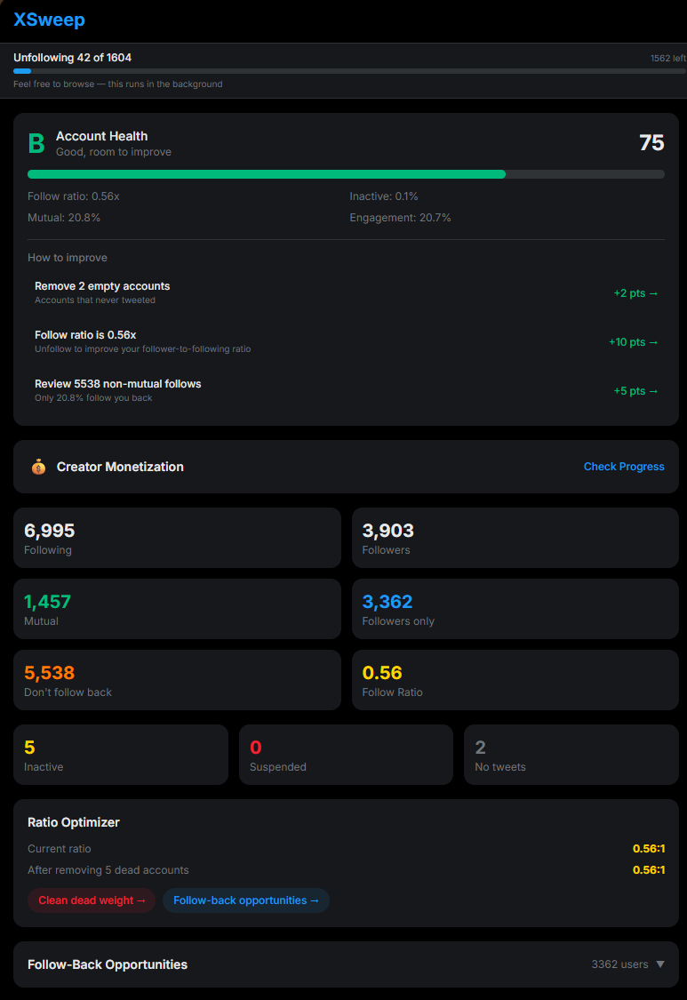
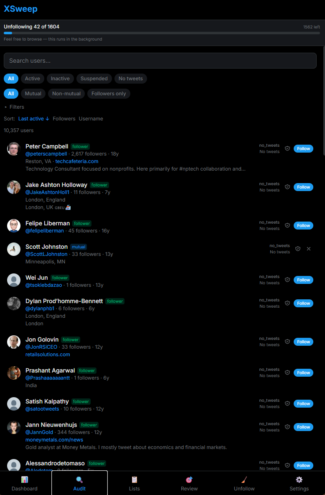
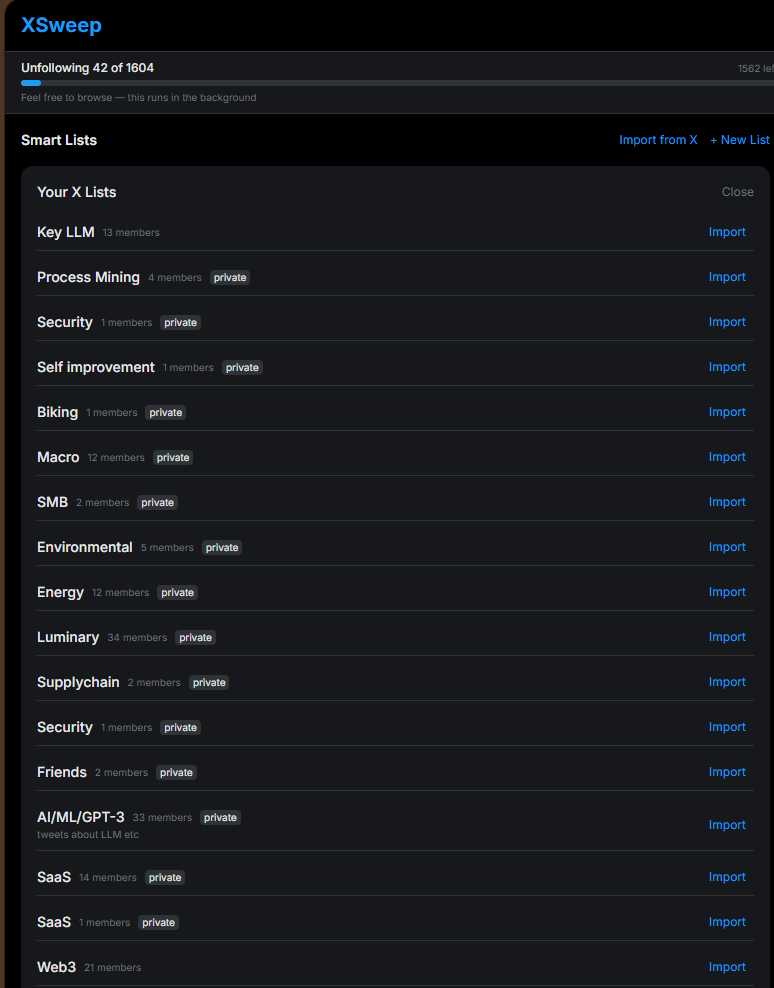
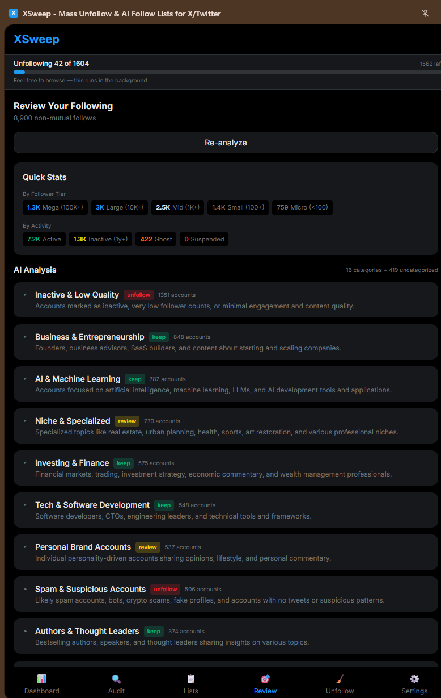
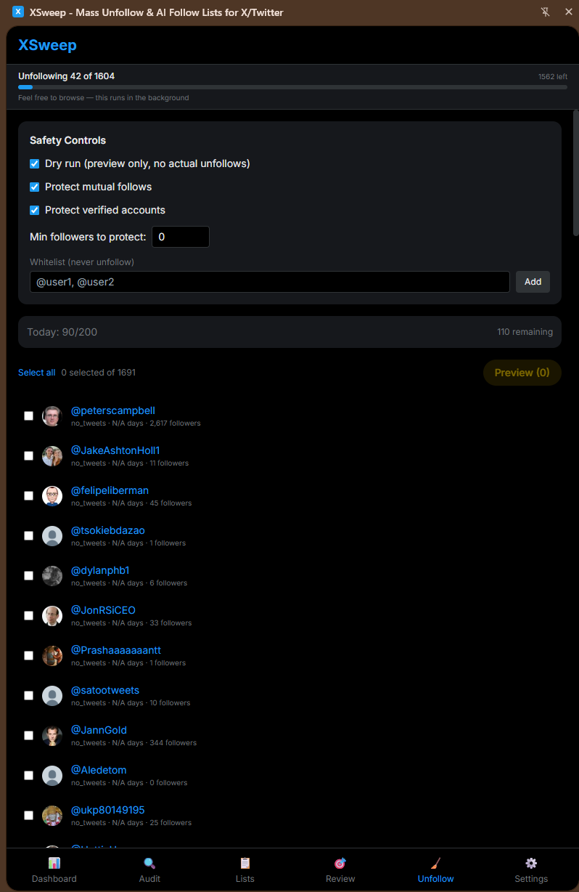

# XSweep

**Clean up your X. Organize who you follow with AI.**

XSweep is a privacy-first Chrome extension for managing who you follow on X (Twitter). It runs entirely in your browser — no data ever leaves your machine.

## Features

### Dashboard

Account health score (A–F) with AI-powered coaching tips. See at a glance how healthy your following list is.



### Audit

Browse everyone you follow with orthogonal filters: combine relationship status (mutual, non-mutual), account status (active, inactive, suspended), follower count ranges, and more. Sort by any column.



### Smart Lists

Organize your following into keyword-based or AI-categorized lists. Sync lists directly to X so they show up in your native X sidebar.



### AI Review

Bring your own Claude API key to categorize accounts automatically. XSweep sends account metadata to Anthropic's API — never credentials or cookies.



### Mass Unfollow

Select accounts to unfollow in bulk with a Gmail-style undo pattern — every unfollow has a 4-second undo window before it executes.



### Monetization Intelligence

Track your X monetization eligibility, estimate payouts, and find your best posting times. No other follow-management tool offers this.


## Privacy

XSweep is designed to be privacy-first:

- **All data stays in your browser** — stored in IndexedDB via the extension's background script
- **No backend server** — the extension talks directly to X's API using your existing session
- **BYOK for AI** — you provide your own Claude API key; XSweep never sees or stores it beyond `chrome.storage.local`
- **Open source** — read every line of code yourself

## Install

### Chrome Web Store

_Coming soon._ For now, install from source — it takes about 2 minutes.

### Quick Start (from source)

You need **Chrome** and a **terminal** (Terminal on Mac, PowerShell on Windows, any terminal on Linux).

**Step 1 — Install Node.js 22**

If you don't have Node.js, grab it from [nodejs.org](https://nodejs.org/) (LTS is fine as long as it's v22+). Verify with:

```bash
node -v   # Should print v22.x.x or higher
```

**Step 2 — Install bun**

```bash
curl -fsSL https://bun.sh/install | bash
```

Then restart your terminal so `bun` is on your PATH.

**Step 3 — Clone and build**

```bash
git clone https://github.com/karlwaldman/xsweep.git
cd xsweep
bun install
bun run build
```

> If you use [nvm](https://github.com/nvm-sh/nvm), the repo includes an `.nvmrc` — just run `nvm use` before `bun install`.

**Step 4 — Load into Chrome**

1. Open Chrome and go to `chrome://extensions`
2. Flip the **Developer mode** toggle in the top-right corner
3. Click the **Load unpacked** button (top left)
4. Navigate to the `xsweep` folder you cloned, then select the `.output/chrome-mv3` subfolder
5. You should see "XSweep" appear in your extensions list

**Step 5 — First use**

1. Go to [x.com](https://x.com) and make sure you're logged in
2. Click the XSweep icon in your Chrome toolbar (puzzle piece icon → pin XSweep if you don't see it)
3. The side panel opens — hit **Scan** to import your following list
4. That's it — explore the Dashboard, Audit, Lists, and more

### Development

```bash
bun run dev          # Start dev server with HMR
bun run test         # Run tests
bun run test:watch   # Run tests in watch mode
```

## AI Setup (Optional)

XSweep's AI features (Review, Smart Lists categorization, Dashboard coaching) require a Claude API key.

1. Get an API key from [console.anthropic.com](https://console.anthropic.com/)
2. Open XSweep → Settings → paste your key
3. That's it — the key is stored locally and sent directly to Anthropic's API

## Tech Stack

- [WXT](https://wxt.dev/) — Chrome extension framework
- [React 19](https://react.dev/) — UI
- [Tailwind CSS](https://tailwindcss.com/) — Styling
- [Dexie](https://dexie.org/) — IndexedDB wrapper
- [Vitest](https://vitest.dev/) — Testing
- TypeScript throughout

## How It Works

XSweep uses X's existing web APIs via your logged-in session. It extracts your session token from the active X tab — the same credentials your browser already uses. No scraping, no third-party auth, no OAuth app.

The extension architecture:

| Component             | Role                                                                        |
| --------------------- | --------------------------------------------------------------------------- |
| **Content script**    | Injected into x.com tabs; extracts auth tokens from the page                |
| **Background script** | Handles API calls, IndexedDB storage, and unfollow operations               |
| **Side panel**        | The main UI — 6 pages (Dashboard, Audit, Lists, Review, Unfollow, Settings) |
| **Popup**             | Quick-launch button that opens the side panel                               |

## Contributing

See [CONTRIBUTING.md](CONTRIBUTING.md) for development setup and guidelines.

## License

[MIT](LICENSE)
